# Телега

Интернет-магазин профессионального инструмента и промышленного оборудования. В проект входят публичный каталог, личный кабинет покупателя, оформление заказов, интеграции с VK и ЮKassa, а также административная панель.

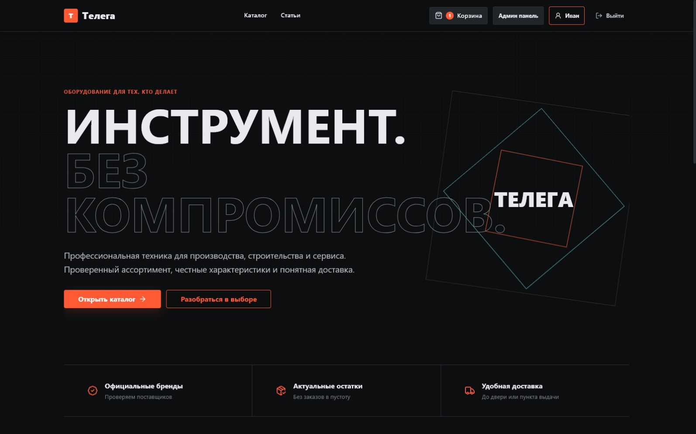

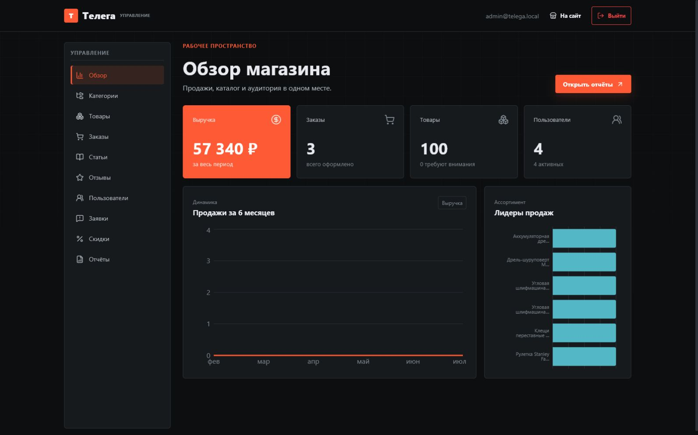

## Интерфейс

### Магазин

| Каталог                                  | Карточка товара                                  |
| ---------------------------------------- | ------------------------------------------------ |
| 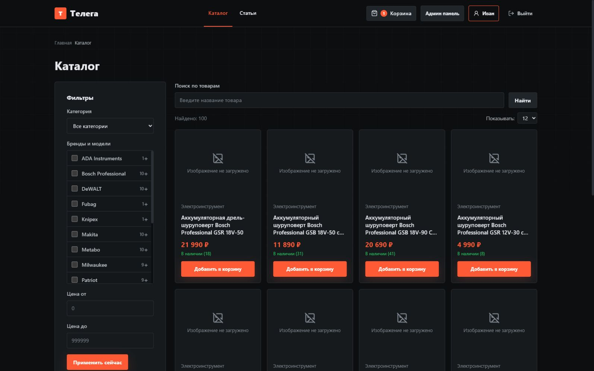 | 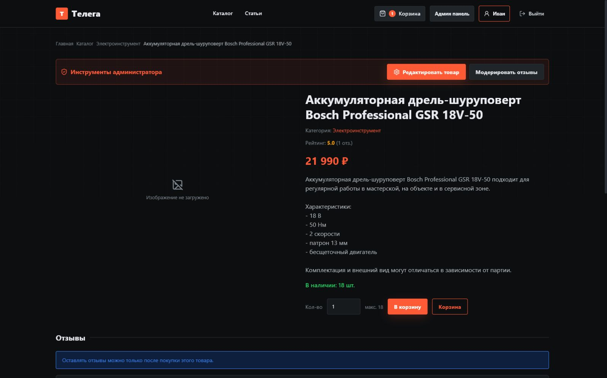 |

| Блог                               | Статья                                  |
| ---------------------------------- | --------------------------------------- |
| 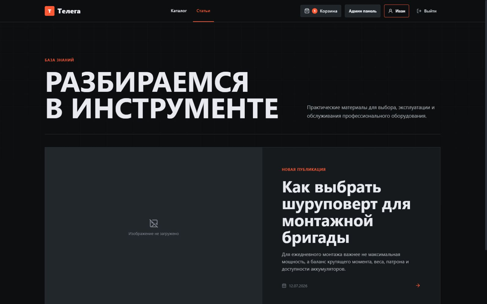 | 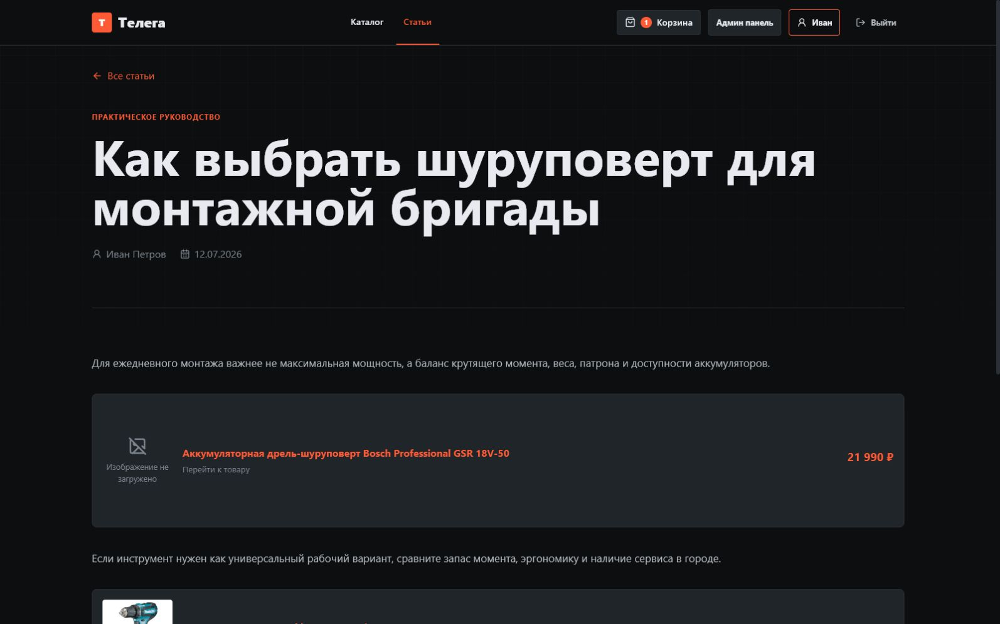 |

| Корзина                               | Вход                                |
| ------------------------------------- | ----------------------------------- |
| 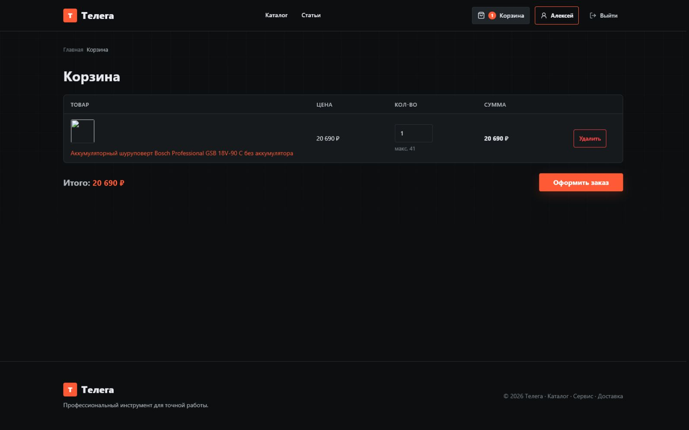 | 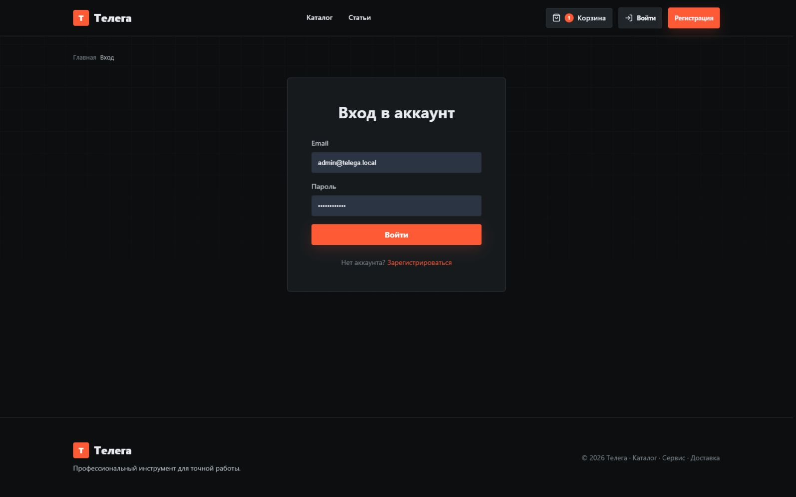 |

| Профиль                                  | Мои заказы                                 |
| ---------------------------------------- | ------------------------------------------ |
| 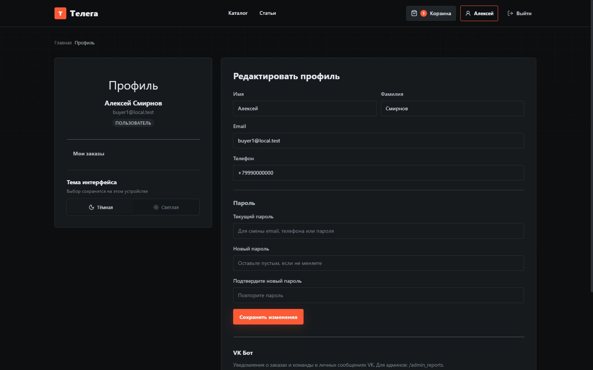 | 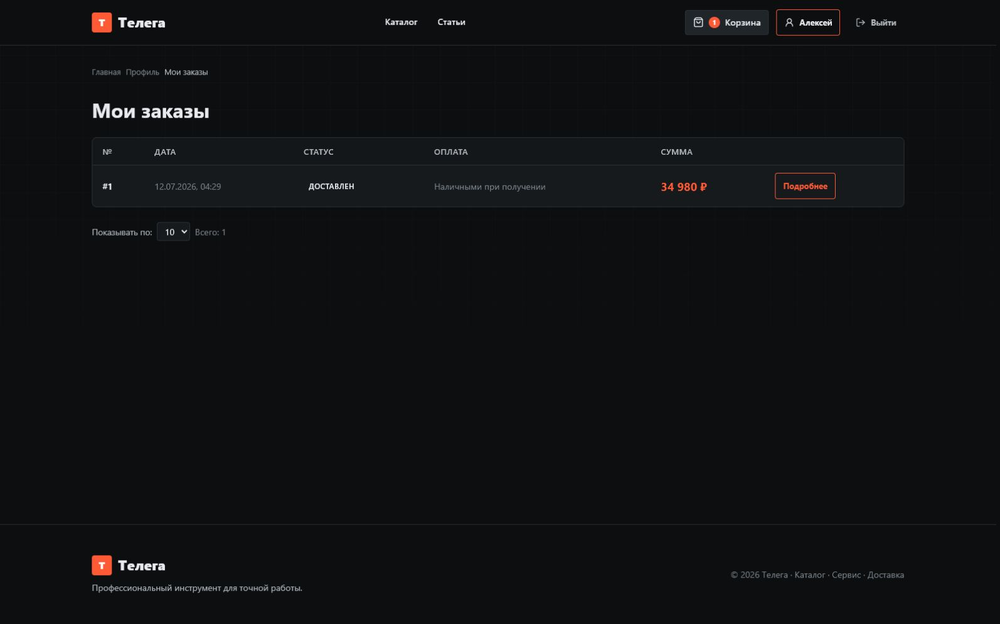 |

### Админ-панель

| Товары                                                      | Заказы                                                    |
| ----------------------------------------------------------- | --------------------------------------------------------- |
| 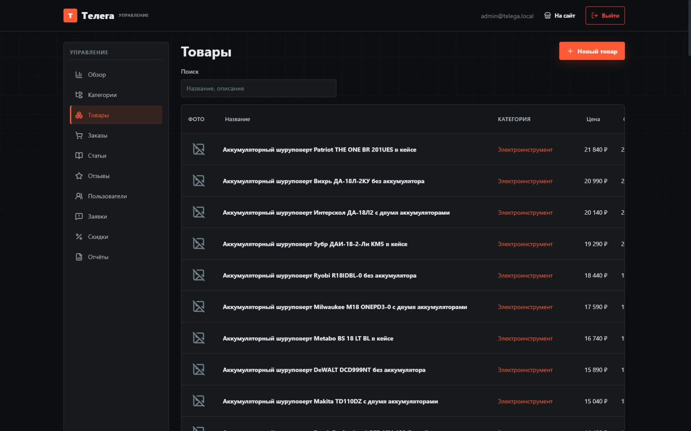 | 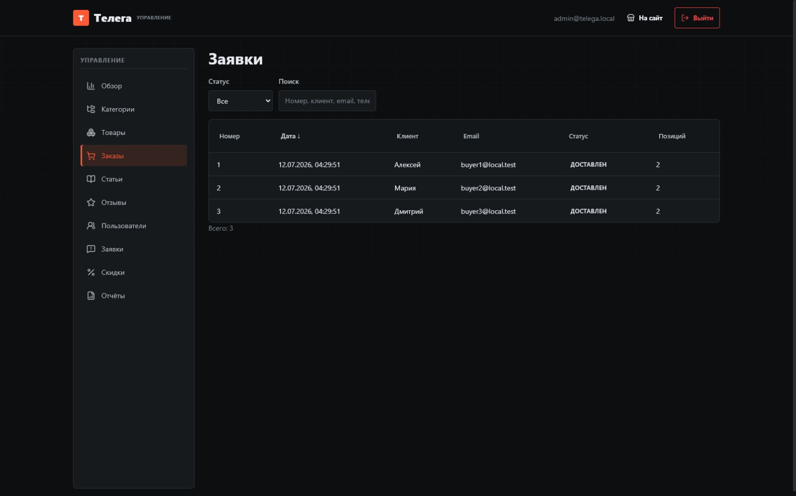 |

| Промокоды                                                       | Отчёты                                        |
| --------------------------------------------------------------- | --------------------------------------------- |
| 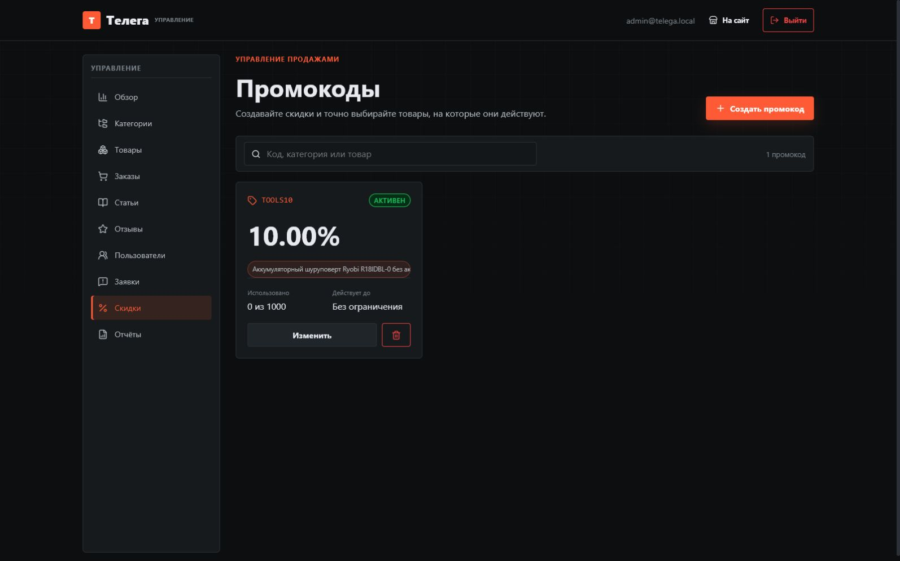 | 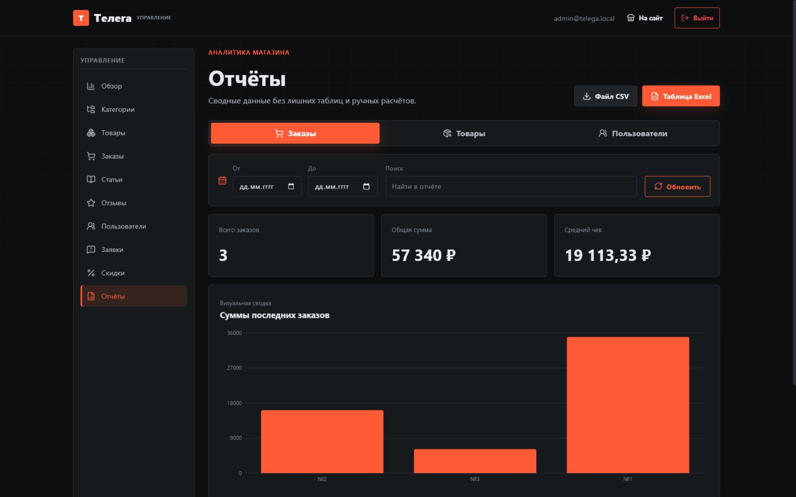 |

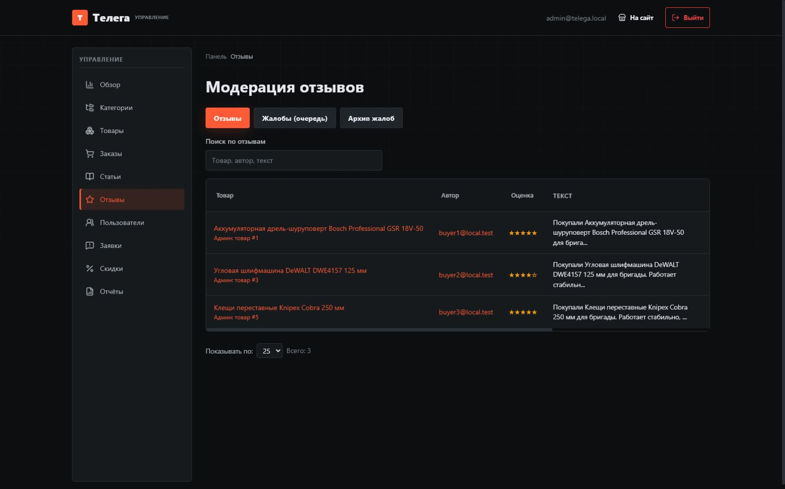

## Что умеет проект

- каталог с поиском, сортировкой, категориями и фасетными фильтрами;
- отдельные характеристики и значения для товаров;
- корзина, промокоды, доставка и оформление заказа;
- профиль покупателя и история заказов;
- отзывы, фотографии, жалобы и модерация;
- статьи и связанные товары;
- управление товарами, категориями, пользователями и заказами;
- промокоды для всего каталога, категории, выбранных товаров или пользователя;
- отчёты с графиками и выгрузкой в CSV и Excel;
- тёмная и светлая темы;
- привязка профиля и уведомления через VK;
- тестовая и рабочая оплата через ЮKassa.

## Интеграции

### VK

Бот работает через API сообществ и Long Poll. При успешном запуске backend выводит `VK Long Poll started`. Пользователь получает в профиле одноразовую ссылку и привязывает свою страницу VK к аккаунту магазина.

После привязки бот:

- присылает уведомления о заказах и заявках;
- показывает последние заказы командой `/orders`;
- позволяет отвязать аккаунт командой `/unlink`;
- сообщает администраторам количество жалоб через `/admin_reports`.

Для запуска нужны `VK_BOT_TOKEN`, `VK_GROUP_ID` и `VK_LONG_POLL_ENABLED=true`.

### ЮKassa

Оформление заказа поддерживает оплату картой через ЮKassa с перенаправлением на защищённую платёжную страницу и возвратом в магазин. Backend создаёт платёж, проверяет его статус и синхронизирует состояние оплаты заказа.

Для разработки предусмотрен демонстрационный сценарий: если реквизиты ЮKassa не заданы, создаётся тестовый платёж `demo-*` без списания денег. При наличии тестовых `YOOKASSA_SHOP_ID` и `YOOKASSA_SECRET_KEY` используется тестовый магазин ЮKassa.

## Технологии

- React 18, Vite, React Router, Axios;
- Node.js, Express, MySQL;
- JWT и bcryptjs;
- Recharts, ExcelJS и PDFKit;
- Jest, Vitest и Testing Library.

## Запуск

Установите зависимости:

```bash
npm install
```

Создайте базу данных и импортируйте схему:

```bash
mysql -u root -p -e "CREATE DATABASE telega CHARACTER SET utf8mb4 COLLATE utf8mb4_unicode_ci;"
mysql -u root -p telega < schema.sql
```

Создайте `backend/.env` и `frontend/.env` на основе файлов `.env.example`, затем заполните демонстрационные данные:

```bash
npm run seed
```

Запустите frontend и backend:

```bash
npm run dev
```

После запуска сайт доступен по адресу `http://localhost:5173`, API - по адресу `http://localhost:3001/api`.


## Основные команды

```bash
npm run dev       # запуск проекта
npm run build     # production-сборка frontend
npm run test:all  # все тесты
npm run seed      # демонстрационные данные
npm run db:setup  # создать схему только в пустой БД
```

## Структура

```text
backend/src/controllers   HTTP-контроллеры
backend/src/models        запросы к MySQL
backend/src/routes        маршруты API
frontend/src/components   общие компоненты
frontend/src/pages        страницы магазина и админки
frontend/src/context      авторизация, корзина, тема и уведомления
frontend/src/styles       общие стили и дизайн-токены
schema.sql                полная схема MySQL
```